# HCMUT Self-Study Room Reservation Website

An easy-to-use way to book a study room at HCMUT for students and a way for managers to manage 🚀

---

## ✨ Features

- 🔐 Security (User authentication, authorization)
- 📅 Booking Study Room
- 📦 View booking history
- 📝 Send feedback

---

## 🛠️ Technology Stack

| Layer       | Tech Stack                                            |
| ----------- | ----------------------------------------------------- |
| 🔙 Backend  | Javascript with ExpressJS                             |
| 🌐 Frontend | HTML, CSS, JavaScript, Bootstrap, React               |
| 🗃️ Database | MySQL                                                 |

## To start the project here are the things to do

1. Clone project
2. Run backend services, cd to each microservices and run "docker-compose up" to start each microservices.
3. Run frontend by using command "npm run start" or "docker-compose up"

## Some picture about website
Sign up page
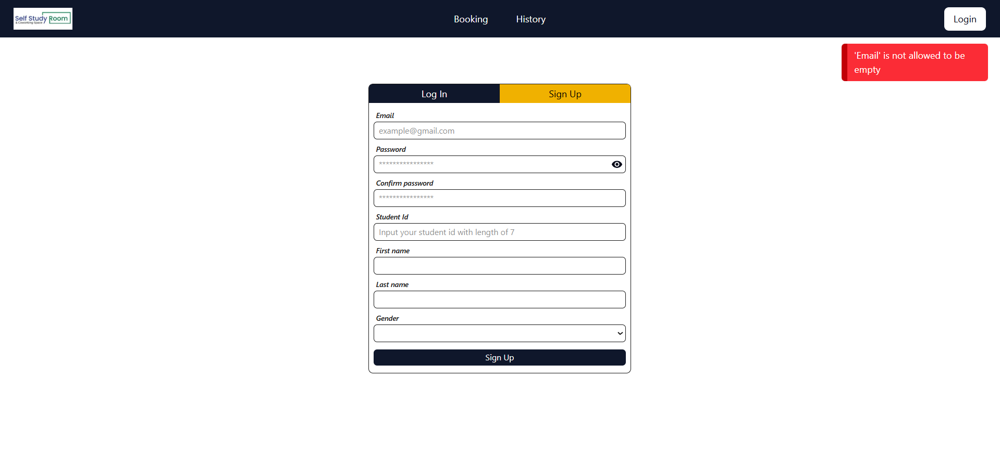

Login page
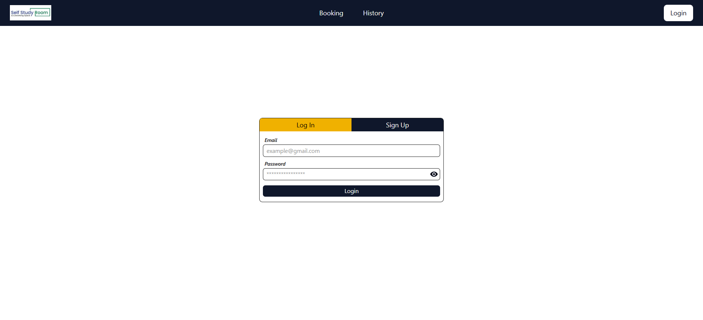

Verify account page (visit the URL sent to user's email)
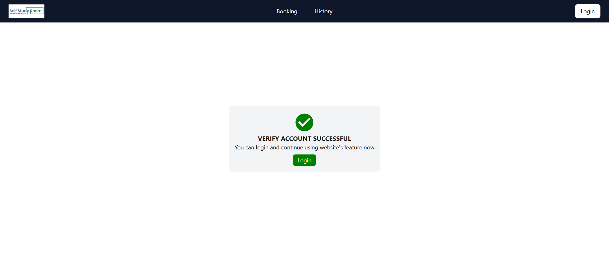

Search room page
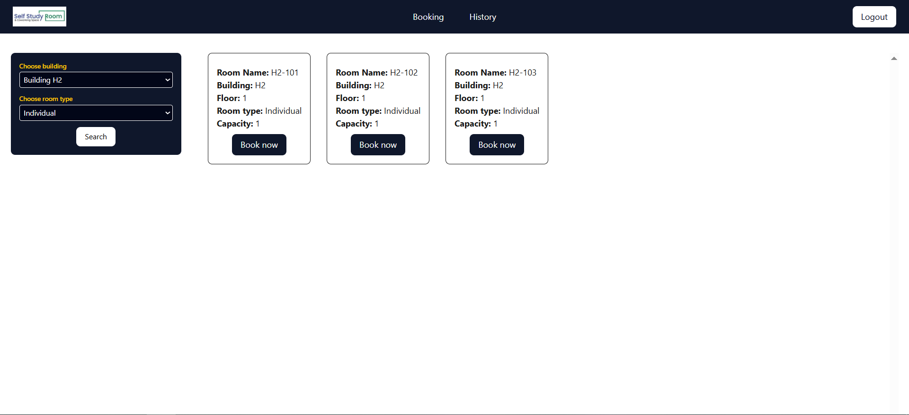

Booking page
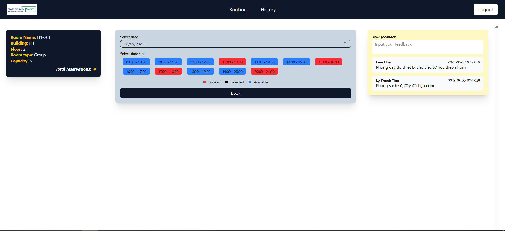

Check in page (user scans QRCode at the room, redirect user to system and verify is check in valid)
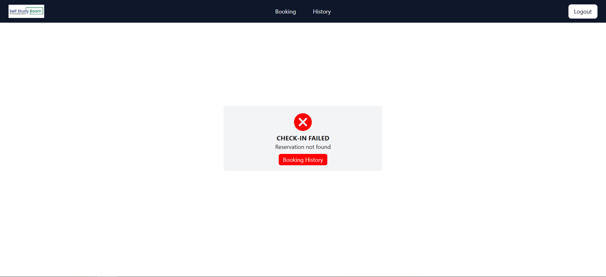

Booking History Page
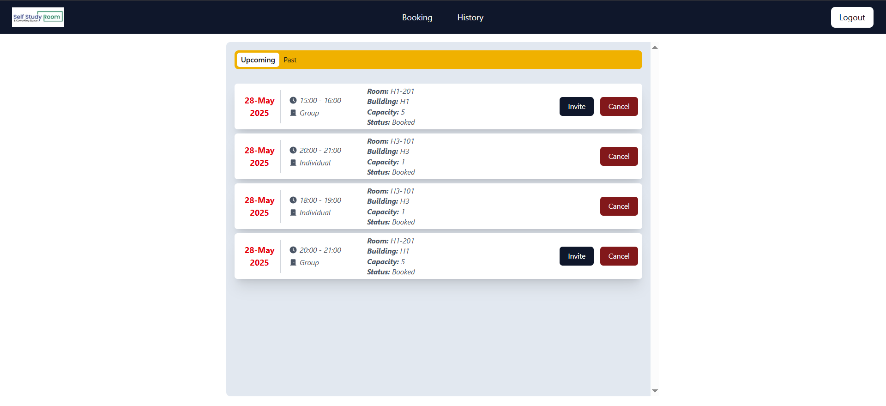

Invite participants to your booking

Search other student
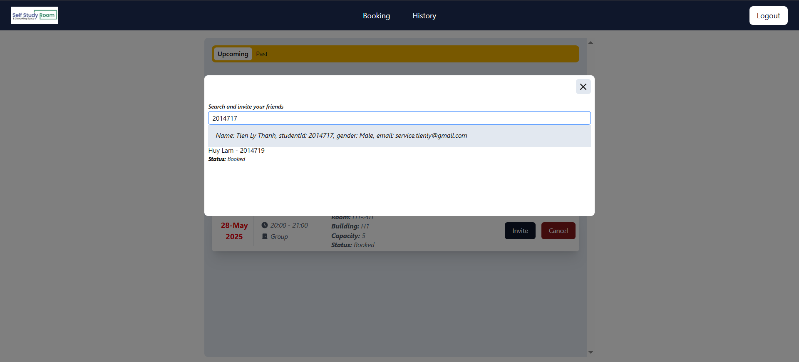
Send invitation
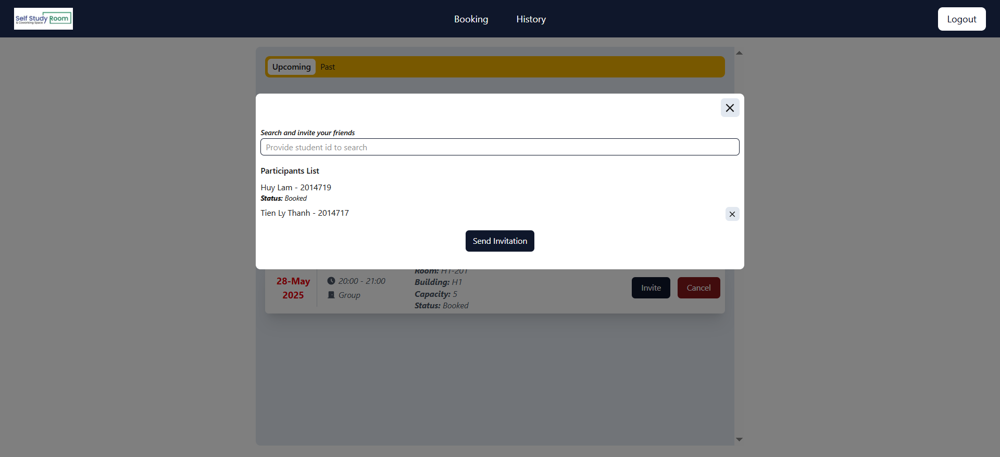
Waiting student to accept the invitation
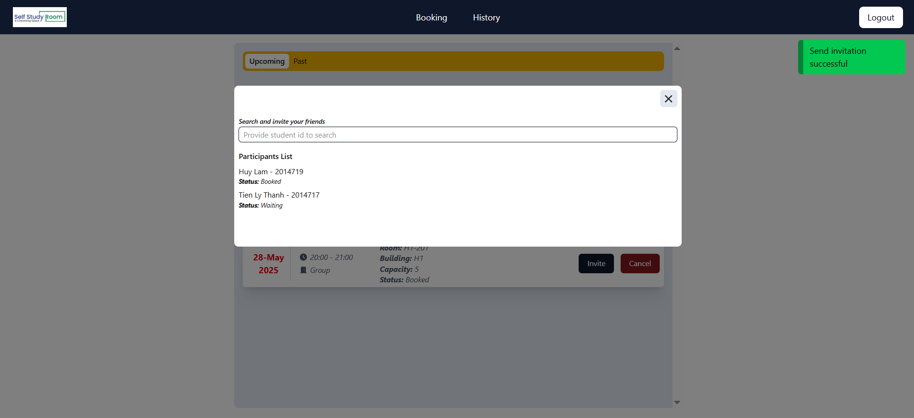

Accept the invitation (visit the URL sent to student email)
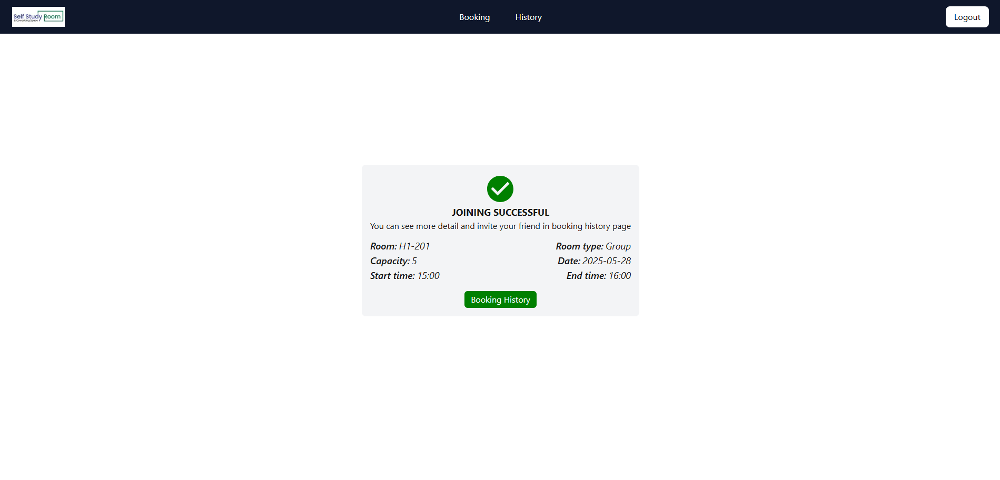
